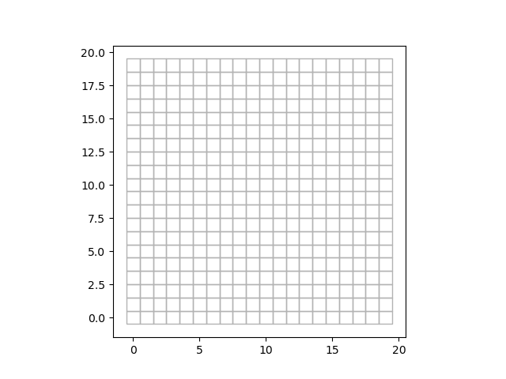
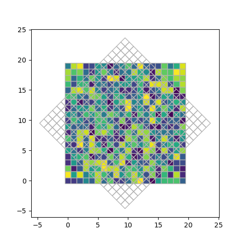
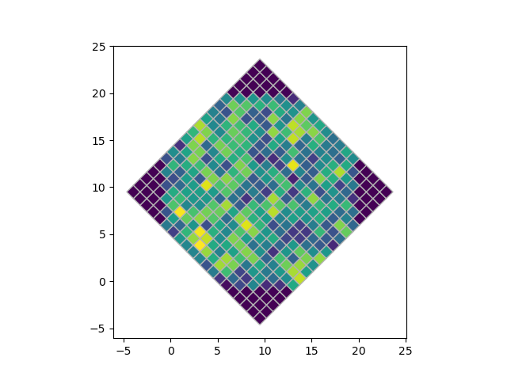

# pixelproject
Project a grid into another

# Install
```bash
git clone https://github.com/MickaelRigault/pixelproject.git
cd pixelproject
python setup.py install
```

### Dependencies
- shapely
- geopandas

# Usage

## Define a Grid
A `Grid` is defined by a list of pixel coordonates (pixel centroids) and pixel shapes. All pixels can share the same shapes or each have their own. Their is no constrain on continuity or shape. 

Let's create a simply square grid
```python
import numpy as np
from pixelproject import grid
pixels_ = np.mgrid[0:20,0:20]
pixel_coords = np.concatenate(pixels_.T, axis=0)
# Let's load the grid. If no shape provided a default 1x1 square will be assigned
g1 = grid.Grid(pixel_coords)
```

Let's see how the grid looks like
```python
g1.show()
```



_**Some details**: [`Shapely`](https://shapely.readthedocs.io/en/stable/project.html) is used to defined each individual pixel shape. All pixels are combined into a [`geopandas`](https://github.com/geopandas/geopandas) DataFrame._

Once the pixels are shapes have been set, a geopandas.GeoDataFrame will be set the first time you call `g1.geodataframe`.

To associated new data to the pixels, simply use the `add_data()` method. Here, let's add random numbers:
```python
values = np.random.uniform(size=g1.npixels)
g1.add_data(values, name="datain")
```

## Project one grid into another

#### Defines the second grid
Let's define a second grid, in this example the same as before but rotated by 40 degrees:

```python

# Define the rotated grid
theta         = 40 *np.pi/180
centroid      = [10,10]
rotmat        = np.asarray([[np.cos(theta), np.sin(theta)],[-np.sin(theta), np.cos(theta)]])
pixels2_ = np.mgrid[0:20,0:20]
pixel_coords2_ = np.concatenate(pixels2_.T, axis=0)
pixel_coords2 = np.dot((pixel_coords2_-np.asarray(centroid)),rotmat)+np.asarray(centroid)
## Remember to also rotate the pixel shapes, and not just the centroids
shape_rot   = np.dot((grid.UNIT_SQUATE-np.asarray([0.5,0.5])),rotmat)+np.asarray([0.5,0.5])

# Define the second grid:
g2 = grid.Grid(pixel_coords2, shape_rot)
```


Now, let's see how these two grid overlap, while displaying the newly added `datain` to `g1`:
```python
import matplotlib.pyplot as plt
fig = plt.figure(figsize=[5,5])
ax = fig.add_subplot(111)
g1.show("datain",ax=ax)
g2.show(ax=ax)
```

#### Load the GridProjector object

To project data associated to the first grid into the second grid, you simply need to load a `GridProjector` object:
```python
mergedgrid = grid.GridProjector(g1,g2)
```
and call the `project_data` method:
```python
datain_to_g2 = mergedgrid.project_data("datain")
```
_In that case datain_to_g2 is a pandas.Series. Set the project_data option `as_serie=False` to has an array._

_**Information:** The project is based on measurement of the overlapping area between each pixels of g1 and g2. This project is stored in `mergedgrid.gridinterest` and is measured the first time you call it. For the given example it take about 300ms to project the 400 pixels of g1 into the 400 pixels of g2. In the above example, `mergedgrid.gridinterest` is called inside `project_data()`. Then, the actual projection of datain into g2 takes about 1ms._

Now let's see how the projection looks like:
```python
datain_to_g2_array = mergedgrid.project_data("datain", as_serie=False)
g2.add_data(datain_to_g2_array, "dataproj")
g2.show("dataproj")
```

